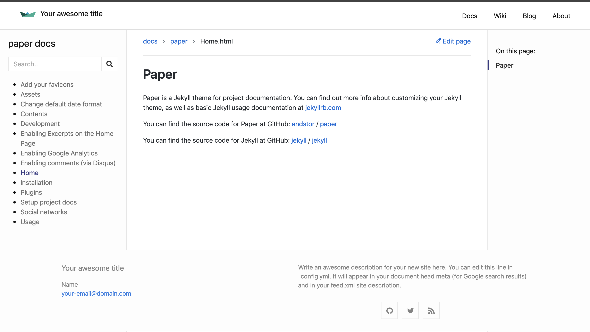

# paper
Paper is a Jekyll theme for project documentation.



## Installation

Add this line to your Jekyll site's Gemfile:

```ruby
gem "jekyll-theme-paper"
```

And then execute:

    $ bundle

## Contents
Paper is based on the [Minima](https://github.com/jekyll/minima) theme (the standard Jekyll theme).
Please read the [Minima documentation](https://github.com/jekyll/minima/blob/master/README.md) for additional details.

### Layouts

Refers to files within the `_layouts` directory, that define the markup for your theme.

  - `default.html` &mdash; The base layout that lays the foundation for subsequent layouts. The derived layouts inject their contents into this file at the line that says ` {{ content }} ` and are linked to this file via [FrontMatter](https://jekyllrb.com/docs/frontmatter/) declaration `layout: default`.
  - `default-wide.html` &mdash; A base layout that supports extra wide layouts.
  - `home.html` &mdash; The layout for your landing-page / home-page / index-page. [[More Info.](#home-layout)]
  - `doc.html` &mdash; The layout for your documentation pages.
  - `page.html` &mdash; The layout for your documents that contain FrontMatter, but are not posts.
  - `post.html` &mdash; The layout for your posts.

#### Home Layout

`home.html` provides a basic HTML layout for the site's landing-page / home-page / index-page. <br/>
Feel free to costumize it to your needs. Use that big brain of yours!

##### *Main Heading and Content-injection*

The *home* layout will inject all content from your `index.md` / `index.html` **before** the **`Posts`** heading. This will allow you to include non-posts related content to be published on the landing page under a dedicated heading. *We recommended that you title this section with a Heading2 (`##`)*.

Usually the `site.title` itself would suffice as the implicit 'main-title' for a landing-page. But, if your landing-page would like a heading to be explicitly displayed, then simply define a `title` variable in the document's front matter and it will be rendered with an `<h1>` tag.

##### *Post Listing*

It will be automatically included only when your site contains one or more valid posts or drafts (if the site is configured to `show_drafts`).

The title for this section is `Posts` by default and rendered with an `<h2>` tag. You can customize this heading by defining a `list_title` variable in the document's front matter.

### Includes

Refers to snippets of code within the `_includes` directory that can be inserted in multiple layouts (and another include-file as well) within the same theme-gem.

  - `head.html` &mdash; Code-block that defines the `<head></head>` in *default* layout.
  - `header.html` &mdash; Defines the site's main header section. By default, pages with a defined `title` attribute will have links displayed here.
  - `social.html` &mdash; Renders social-media icons based on the `minima:social_links` data in the config file.
  - `breadcrumbs.html` &mdash; Renders bredcrumbs based on the passed include variables **url** and **edit_url**.
  - `sidebar.html` &mdash; Renders a sidebar for navigating the docs.
  - `toc.html` &mdash; Renders a table of contents list.

### Assets

Refers to various asset files within the `assets` directory.
Contains the `css/style.scss` that imports sass files from within the `_sass` directory. This `css/style.scss` is what gets processed into the theme's main stylesheet `main.css` called by `_layouts/default.html` via `_includes/head.html`.

This directory can include sub-directories to manage assets of similar type (`img`, `fonts`, `svg`), and will be copied over as is, to the final transformed site directory.

### Plugins

Paper comes with multiple plugins:

  - `jekyll-feed`
  - [`jekyll-seo-tag`](https://github.com/jekyll/jekyll-seo-tag) plugin preinstalled to make sure your website gets the most useful meta tags. See [usage](https://github.com/jekyll/jekyll-seo-tag#usage) to know how to set it up.
  - `jekyll-optional-front-matter`
  - `jemoji`

## Usage

Have the following line in your config file:

```yaml
theme: jekyll-theme-paper
```
### Setup project docs

#### Add project

To add project documentation, one must do the following
Create a `docs` folder if it doesn't already exists.
Inside it, create a new folder to hold the actual documentation files (mainly Markdown files). Name the folder the same as the project name. 

The docs folder structure should look this:

```
/docs/
├── project-1
├── project-2
└── ...
```
#### Documentation landing page

Every project needs an index.html file.
This serves as a landing page for the documentation of the specific project.

Set the file front matter `layout` to `doc`, and `repo` to the name the project name.

Define the variable `start_page` to use an existing documentation page as the initial page. For example `home.md`. 

One may choose to create a costom landing page.
Just don't include the `start_page` front matter variable, and any contents to this page will be displayed on the page.

#### Project data

Create a `_data` folder if it doesn't already exists.


##### Types

Inside the `_data` folder, create a types.yml file.
Here you define the project types you want to define. 
```
type:
  name: type_name
  description: Some descriptive text.
```

##### Projects

Inside the `_data` folder, create a projects.yml file.
Here you add info about the project(s) you want to add documentaion for. 

Each project should have the following structure:
```
project_name:
  name: display_name
  repo_name: repository_name
  type: 
    - type1
    - type2
  owner: owner_name
  url: repository_url
  wiki_url: repository_wiki_url
  icon: icon_picture_location
```

Note that a project may have several types.

###### Wiki

If you define a wiki [type](#types), this will show up on the  home page and will be excluded from the documentation page.
You may add a link in the navigation header by linking to the index.html file for the wiki type project. See [Customize navigation links](#customize-navigation-links)
```
wiki:
  name: wiki_name
  description: Wiki description
```

#### Default front matter
 
 Some front matter variables are required for all the documentation files.
 These are configured in the `_config.yml` file, with one entry per project.
 
 ```
 -
  #   scope:
  #     path: "docs/capquiz"
  #   values:
  #     layout: "doc"
  #     repo: "capquiz"
```

### Customize navigation links

This allows you to set which pages you want to appear in the navigation area and configure order of the links.

For instance, to only link to the `about` and the `portfolio` page, add the following to your `_config.yml`:

```yaml
header_pages:
  - about.md
  - portfolio.md
```

### Change default date format

You can change the default date format by specifying `site.minima.date_format`
in `_config.yml`.

```
# Minima date format
# refer to http://shopify.github.io/liquid/filters/date/ if you want to customize this
minima:
  date_format: "%b %-d, %Y"
```

### Add your favicons

1. Head over to [https://realfavicongenerator.net/](https://realfavicongenerator.net/) to add your own favicons.
2. Customize default `_includes/head.html` in your source directory and insert the given code snippet.


### Enabling comments (via Disqus)

Optionally, if you have a Disqus account, you can tell Jekyll to use it to show a comments section below each post.

To enable it, add the following lines to your Jekyll site:

```yaml
  disqus:
    shortname: my_disqus_shortname
```

You can find out more about Disqus' shortnames [here](https://help.disqus.com/installation/whats-a-shortname).

Comments are enabled by default and will only appear in production, i.e., `JEKYLL_ENV=production`

If you don't want to display comments for a particular post you can disable them by adding `comments: false` to that post's YAML Front Matter.

:warning: `url`, e.g. `https://example.com`, must be set in you config file for Disqus to work.


### Social networks

You can add links to the accounts you have on other sites, with respective icon, by adding one or more of the following options in your config.

```yaml
minima:
  social_links:
    twitter: jekyllrb
    github: jekyll
    dribbble: jekyll
    facebook: jekyll
    flickr: jekyll
    instagram: jekyll
    linkedin: jekyll
    pinterest: jekyll
    telegram: jekyll
    googleplus: +jekyll
    microdotblog: jekyll
    rss: rss

    mastodon:
     - username: jekyll
       instance: example.com
     - username: jekyll2
       instance: example.com

    youtube: jekyll
    youtube_channel: UC8CXR0-3I70i1tfPg1PAE1g
    youtube_channel_name: CloudCannon
```

### Enabling Google Analytics
To enable Google Analytics, add the following lines to your Jekyll site:

```yaml
  google_analytics: UA-NNNNNNNN-N
```

Google Analytics will only appear in production, i.e., `JEKYLL_ENV=production`

### Enabling Excerpts on the Home Page
To display post-excerpts on the Home Page, simply add the following to your `_config.yml`:

```yaml
show_excerpts: true
```

## Contributing
Bug reports and pull requests are welcome on GitHub at https://github.com/andstor/jekyll-theme-paper.

## Development
To set up your environment to develop this theme, run `script/bootstrap`.

To test your theme, run `script/server` (or `bundle exec jekyll serve`) and open your browser at `http://localhost:4000`. This starts a Jekyll server using your theme and the contents. As you make modifications, your site will regenerate and you should see the changes in the browser after a refresh.

## License
The theme is available as open source under the terms of the [MIT License](http://opensource.org/licenses/MIT).
